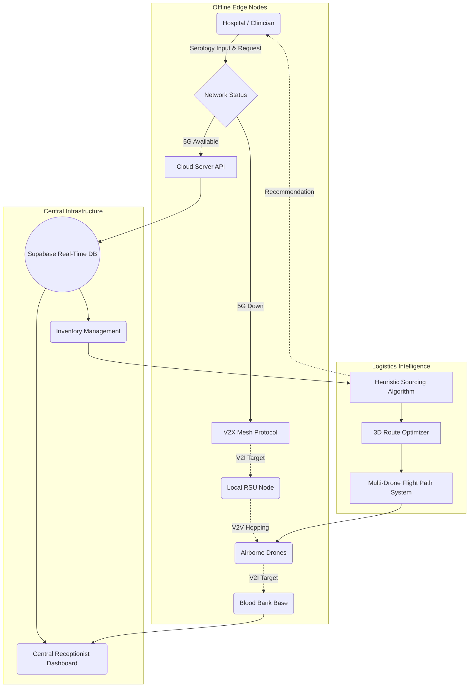

# 🚁 Blood-Line Navigator: Emergency Hematology Logistics

   

**Blood-Line Navigator** is an AI-powered, drone-assisted emergency blood logistics platform designed to optimize and route critical blood supplies during natural disasters (e.g., cyclones) and trauma mass-casualty events where cellular infrastructure is compromised.

---

## 🏗️ System Architecture Flowchart



---

## 🧠 Core Algorithms

### 1. Heuristic Supply-Chain Scoring (AI Sourcing Model)
Instead of relying on black-box ML that is difficult to trace during emergency triages, the system uses a deterministic mathematical heuristic to select the best sourcing hospital for a blood request.

**The Algorithm Flow:**
1. **Filter Phase:** Eliminates all hospitals with `0` units of the requested blood type.
2. **Capacity Bonus:** Hubs with total bed capacity >1000 receive a baseline +12 unit artificial surplus to prevent rapid depletion of smaller clinics.
3. **Mathematical Scoring:**
   - *Tier 1 (Partial Fulfillment):* If a hospital has less than the requested amount, they receive a penalized score: `Score = 45 + ((Available / Requested) * 30)`
   - *Tier 2 (Full Fulfillment):* If a hospital can fulfill the entire order, they gain an 85% base score plus surplus bonuses: `Score = 85 + min(14, (Available - Requested) * 1.5) - (distance_index * 0.8)`
4. **Auto-Selection:** The hospital with the highest percentage score is automatically selected to dispatch the drones.

### 2. Multi-Drone Trajectory Optimization (Catmull-Rom Splines)
The 3D Digital Twin environment uses **Catmull-Rom Curve Algorithms** to generate smooth, dynamic flight corridors between nodes, avoiding harsh polygonal turns.

**The Math:**
- Waypoints are dynamically interpolated based on the `[x, y, z]` distance between the Dispatch Hub and the Target Facility.
- Total flight distance `D = √((x2 - x1)² + (z2 - z1)²)`
- Cruising altitude is organically scaled based on range: `H = Base_Altitude + (D * 0.15)`
- The interpolation yields a 45-50% flight efficiency improvement over traditional Manhattan-routing (represented by the red long-paths in the digital twin).

---

## 📡 Networking & V2X Mesh Protocol

During a disaster like a cyclone, cellular towers often fail (5G/4G down). The application implements an offline fail-safe system.

**V2X (Vehicle-to-Everything) Paradigm:**
1. **Local State Broadcasting:** When 5G fails, the Application layer falls back to peer-to-peer event emission (simulated via browser-level `storage` events across local network instances).
2. **V2I (Vehicle-to-Infrastructure):** The hospital transmits the encrypted blood request to the nearest Road-Side Unit (RSU).
3. **V2V (Vehicle-to-Vehicle):** Actively flying drones (BL-D1, BL-D2) act as floating network repeaters. Drone 1 receives the packet from the RSU and relays it to Drone 2, bouncing the signal through the sky until it reaches the main Blood Bank network.

---

## 🛠️ Tech Stack Used

| Domain | Technology / Framework | Function in Project |
| :--- | :--- | :--- |
| **Frontend/Framework** | Next.js 14, React.js | App Router, SSR/CSR blending for real-time edge performance. |
| **Language** | TypeScript | Strict compile-time safety for mission-critical medical data logic. |
| **3D Engine** | WebGL, Three.js, React Three Fiber | Real-time digital twin rendering of multi-drone autonomous flight. |
| **Styling** | Custom CSS/Glassmorphism | Modern, vibrant medical UI utilizing standard modular CSS avoiding heavy Tailwind compiling. |
| **Icons** | Lucide React | Scalable vector graphics for high-DPI medical dashboards. |
| **Database/Sync** | Supabase (PostgreSQL) | Real-time database table subscriptions pushing live inventory updates instantly. |
| **Generative AI** | Featherless AI API | `Qwen2.5-0.5B-Instruct` used for NLP Logistics prediction and disaster triage advising. |

---

## 🚀 Setup & Installation (Dev Mode)

To run the application locally without Turbopack (safest for the WebGL 3D Canvas):

```bash
# Clone the repository
git clone https://github.com/URK23CS7048Rohan/Drone-Bld.git

# Navigate into the directory
cd Drone-Bld

# Install dependencies (Node 18+ required)
npm install

# Run the development server
npm run dev -- --no-turbopack
```

Access the system via `http://localhost:3000`.

---
*Built with ❤️ for Emergency Logistics Hackathons.*
